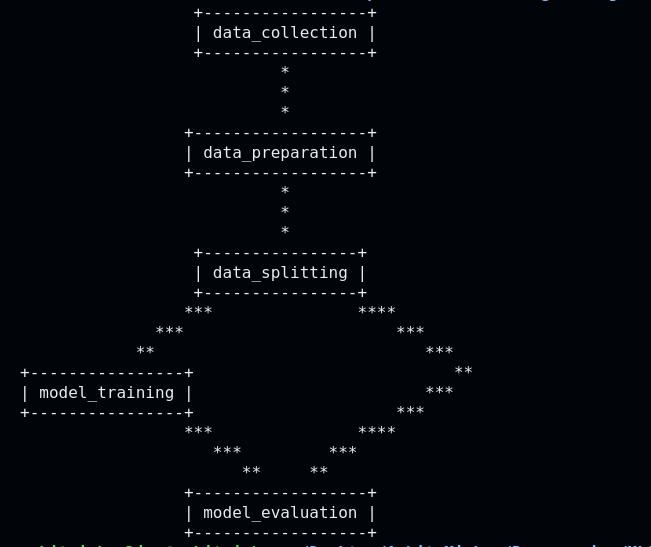

ML Pipeline for predicting water potability based on various chemical properties
==============================
 
This project is a comprehensive machine learning pipeline designed to predict the potability of water. It integrates various stages of the machine learning lifecycle, from data extraction and cleaning to model training and evaluation. The pipeline is built using DVC (Data Version Control) to manage data, models, and metrics efficiently.

## DAG

   

Project Organization
------------

    ├── LICENSE
    ├── README.md          <- The top-level README for developers using this project.
    ├── data
    │   ├── external       <- Data from third party sources.
    │   ├── interim        <- Intermediate data that has been transformed.
    │   ├── processed      <- The final, canonical data sets for modeling.
    │   └── raw            <- The original, immutable data dump.
    │
    ├── models             <- Trained and serialized models, model predictions, or model summaries
    │
    ├── notebooks          <- Jupyter notebooks. Naming convention is a number (for ordering),
    │                         the creator's initials, and a short `-` delimited description, e.g.
    │                         `1.0-jqp-initial-data-exploration`.
    │
    ├── references         <- Data dictionaries, manuals, and all other explanatory materials.
    │
    ├── reports            <- Generated analysis as HTML, PDF, LaTeX, etc.
    │   └── figures        <- Generated graphics and figures to be used in reporting
    │
    ├── requirements.txt   <- The requirements file for reproducing the analysis environment, e.g.
    │                         generated with `pip freeze > requirements.txt`
    │
    ├── setup.py           <- makes project pip installable (pip install -e .) so src can be imported
    ├── src                <- Source code for use in this project.  │   
    │   │
    │   ├── data           <- Scripts to download or generate data
    │   │   └── make_dataset.py
    │   │
    │   ├── features       <- Scripts to turn raw data into features for modeling
    │   │   └── build_features.py
    │   │
    │   ├── models         <- Scripts to train models and then use trained models to make
    │   │   │                 predictions
    │   │   ├── predict_model.py
    │   │   └── train_model.py
    │   │
    │   └── visualization  <- Scripts to create exploratory and results oriented visualizations
    │       └── visualize.py
    │
    └── tox.ini            <- tox file with settings for running tox; see tox.readthedocs.io

## Pipeline Stages

1. **Data Collection**
   - **Command**: `python src/extract_dataset.py`
   - **Description**: Extracts the raw data from zip files into the `data/raw/extracted` directory.

2. **Data Preparation**
   - **Command**: `python src/data_preparation.py`
   - **Description**: Cleans and preprocesses the extracted data, removing outliers and imputing missing values. Outputs cleaned data to `data/interim/cleaned_data.csv`.

3. **Data Splitting**
   - **Command**: `python src/data_splitting.py`
   - **Description**: Splits the cleaned data into training and testing sets. Saves the splits to `data/processed/`.

4. **Model Training**
   - **Command**: `python src/model_training.py`
   - **Description**: Trains a LightGBM model using the training data and saves the model to `models/model.pkl`.

5. **Model Evaluation**
   - **Command**: `python src/model_evaluation.py`
   - **Description**: Evaluates the trained model on the test data and saves the evaluation metrics to `metrics/metrics.json`.

--------

<small>Project based on the <a target="_blank" href="https://drivendata.github.io/cookiecutter-data-science/">cookiecutter data science project template</a>. #cookiecutterdatascience</small>

